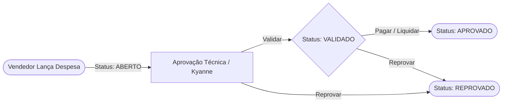

<div align="center">

# 🏛️ Portal de Gestão de Despesas — Saavedra

<p align="center">
  <strong>Sistema Corporativo para Lançamento, Validação Técnica e Pagamento de Despesas Comerciais</strong>
</p>

<p align="center">
  
  
  
  
</p>

---

</div>

<section id="sobre">
<h2>📖 Sobre o Projeto</h2>

<p>
O <strong>Portal de Despesas Saavedra</strong> é uma solução desenvolvida para substituir a antiga planilha Google Apps Script legada, modernizando o fluxo de prestação de contas, aprovações gerenciais e liquidação financeira das despesas de deslocamento, alimentação e operações da equipe externa/comercial.
</p>

</section>

<hr />

<section id="funcionalidades">
<h2>✨ Principais Funcionalidades</h2>

<table width="100%">
  <thead>
    <tr>
      <th>Módulo</th>
      <th>Descrição</th>
      <th>Acesso</th>
    </tr>
  </thead>
  <tbody>
    <tr>
      <td><strong>🔐 Autenticação Segura</strong></td>
      <td>Login por e-mail e senha integrado ao Supabase Auth com sessão persistente.</td>
      <td>Todos os usuários</td>
    </tr>
    <tr>
      <td><strong>📊 Dashboard com KPIs</strong></td>
      <td>Métricas em tempo real de despesas pendentes, valores acumulados e status.</td>
      <td>Personalizado por Função</td>
    </tr>
    <tr>
      <td><strong>📝 Minhas Despesas</strong></td>
      <td>Lançamento de despesas, categoria, valor, data e anexo de comprovante/foto.</td>
      <td>Vendedor / Colaborador</td>
    </tr>
    <tr>
      <td><strong>✅ Esteira de Aprovações</strong></td>
      <td>Fluxo em 2 etapas: Validação Técnica (Kyanne/Gestão) & Pagamento (Financeiro).</td>
      <td>Kyanne, Financeiro, Admin</td>
    </tr>
    <tr>
      <td><strong>📈 Relatórios & Exportação</strong></td>
      <td>Filtros por período/status e exportação direta para planilha Excel (CSV UTF-8).</td>
      <td>Todos (com escopo de perfil)</td>
    </tr>
    <tr>
      <td><strong>👥 Gestão de Colaboradores</strong></td>
      <td>Painel administrativo para vincular contas, alterar papéis e permissões.</td>
      <td>Apenas Administradores</td>
    </tr>
  </tbody>
</table>

</section>

<hr />

<section id="fluxo-aprovacao">
<h2>🔄 Fluxo de Aprovação de Despesas</h2>



<ol>
  <li><strong>Lançamento:</strong> O colaborador cadastra o valor, data, categoria e anexa a foto da nota fiscal/recibo (<code>ABERTO</code>).</li>
  <li><strong>Validação Técnica:</strong> A supervisão/gerência técnica confere a pertinência da despesa (<code>VALIDADO</code>).</li>
  <li><strong>Liquidação Financeira:</strong> O time financeiro efetua o reembolso/pagamento e encerra o fluxo (<code>APROVADO</code>).</li>
</ol>

</section>

<hr />

<section id="tecnologias">
<h2>🛠️ Tecnologias Utilizadas</h2>

<ul>
  <li><strong>Frontend:</strong> React 19, React Router DOM 7, CSS3 Vanilla (Glassmorphism & Responsivo).</li>
  <li><strong>Build & Tooling:</strong> Vite 8, Oxlint.</li>
  <li><strong>Backend as a Service:</strong> Supabase (PostgreSQL, Row Level Security, Auth, Storage Bucket <code>comprovantes</code>).</li>
</ul>

</section>

<hr />

<section id="estrutura">
<h2>📂 Estrutura de Pastas</h2>

```text
portal_despesas_saavedra/
├── .env.example            # Modelo das variáveis de ambiente
├── .gitignore              # Regras de exclusão do Git
├── package.json            # Dependências e scripts do projeto
├── index.html              # HTML5 de entrada
├── vite.config.js          # Configuração do Vite
├── scripts/
│   └── createUsers.js      # Script de carga inicial de usuários no Supabase
└── src/
    ├── main.jsx            # Ponto de entrada React
    ├── App.jsx             # Roteamento e verificação de autenticação
    ├── index.css           # Estilização global e tokens visuais
    ├── lib/
    │   └── supabase.js     # Inicialização do cliente Supabase
    ├── services/
    │   ├── auth.js         # Serviço de login e sessões
    │   ├── expenses.js     # CRUD de despesas e upload de anexos
    │   └── admin.js        # Gestão de perfis e colaboradores
    ├── components/
    │   └── Layout.jsx      # Shell principal e barra de navegação
    └── pages/
        ├── Login.jsx       # Tela de acesso
        ├── Dashboard.jsx   # Visão geral e cartões de métricas
        ├── Despesas.jsx    # Lançamentos e extrato individual
        ├── Aprovacoes.jsx  # Painel de esteira de aprovação
        ├── Relatorios.jsx  # Filtros avançados e exportação CSV
        └── Admin.jsx       # Gestão de colaboradores e permissões
```

</section>

<hr />

<section id="instalacao">
<h2>🚀 Como Executar o Projeto</h2>

<h3>1. Pré-requisitos</h3>
<ul>
  <li><a href="https://nodejs.org/" target="_blank">Node.js</a> (versão 18 ou superior)</li>
  <li>NPM ou Yarn</li>
</ul>

<h3>2. Clonar e Instalar Dependências</h3>

```bash
# Instalar os pacotes
npm install
```

<h3>3. Configurar Variáveis de Ambiente</h3>

<p>Crie um arquivo <code>.env</code> na raiz do projeto copiando o modelo <code>.env.example</code>:</p>

```env
VITE_SUPABASE_URL=https://seu-projeto.supabase.co
VITE_SUPABASE_ANON_KEY=sua-chave-anonima-publica
```

<h3>4. Executar em Modo de Desenvolvimento</h3>

```bash
npm run dev
```

<p>Acesse no navegador: <code>http://localhost:5173</code></p>

<h3>5. Build de Produção</h3>

```bash
npm run build
```

</section>

<hr />

<section id="proximos-passos">
<h2>📋 Próximos Passos & Roadmap</h2>

<ul>
  <li>[ ] Ajustar verificação da role <code>Admin</code> no serviço de despesas para visibilidade global.</li>
  <li>[ ] Incluir campo <code>Cliente / Obra</code> no modal de cadastro de despesas.</li>
  <li>[ ] Adicionar cabeçalho BOM UTF-8 no download de CSV para compatibilidade com o Excel Windows.</li>
  <li>[ ] Implementar sistema de toasts para substituição dos <code>alert()</code> nativos.</li>
  <li>[ ] Configurar políticas de RLS (Row Level Security) refinadas no banco de dados Supabase.</li>
</ul>

</section>

<hr />

<div align="center">
  <p><sub>Saavedra &copy; 2026 — Todos os direitos reservados.</sub></p>
</div>
