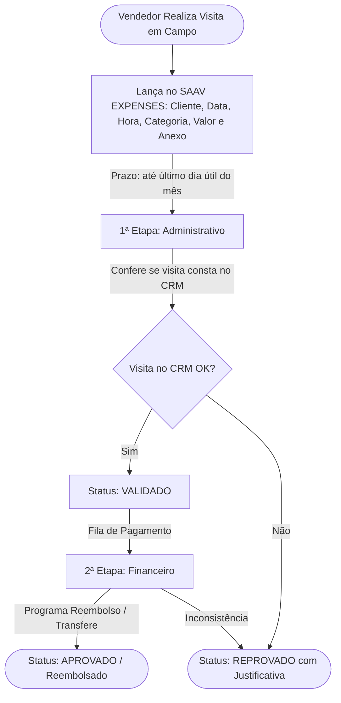

<div align="center">

# 🏛️ SAAV EXPENSES — Sistema de Despesas da Saavedra

<p align="center">
  <strong>Sistema Corporativo para Lançamento, Validação Técnica e Pagamento de Despesas Comerciais</strong>
</p>

<p align="center">
  
  
  
  
</p>

---

</div>

<section id="sobre">
<h2>📖 Sobre o Projeto</h2>

<p>
O <strong>SAAV EXPENSES</strong> é o sistema oficial de gestão de despesas da <strong>Saavedra</strong>, desenvolvido para substituir a antiga planilha Google Apps Script legada, modernizando o fluxo de prestação de contas, aprovações gerenciais e liquidação financeira das despesas de deslocamento, alimentação e operações da equipe externa/comercial.
</p>

</section>

<hr />

<section id="funcionalidades">
<h2>✨ Principais Funcionalidades</h2>

<table width="100%">
  <thead>
    <tr>
      <th>Módulo</th>
      <th>Descrição</th>
      <th>Acesso</th>
    </tr>
  </thead>
  <tbody>
    <tr>
      <td><strong>🔐 Autenticação Segura</strong></td>
      <td>Login por e-mail e senha integrado ao Supabase Auth com sessão persistente.</td>
      <td>Todos os usuários</td>
    </tr>
    <tr>
      <td><strong>📊 Dashboard com KPIs</strong></td>
      <td>Métricas em tempo real de despesas pendentes, alerta de prazo do mês e status.</td>
      <td>Personalizado por Função</td>
    </tr>
    <tr>
      <td><strong>📝 Minhas Despesas (Visitas)</strong></td>
      <td>Lançamento com Cliente/Onde esteve, Data, Horário, Plano de Contas e Comprovante.</td>
      <td>Vendedor / Colaborador</td>
    </tr>
    <tr>
      <td><strong>✅ Esteira de Aprovações</strong></td>
      <td>Fluxo em 2 etapas: Validação no CRM (Administrativo) & Liquidação (Financeiro).</td>
      <td>Gestores, Financeiro, Admin</td>
    </tr>
    <tr>
      <td><strong>📈 Relatórios & Exportação</strong></td>
      <td>Filtros por período/status/categoria e exportação para Excel (CSV com BOM UTF-8).</td>
      <td>Todos (com escopo de perfil)</td>
    </tr>
    <tr>
      <td><strong>👥 Gestão de Colaboradores</strong></td>
      <td>Painel administrativo para vincular contas, alterar papéis e permissões.</td>
      <td>Apenas Administradores</td>
    </tr>
  </tbody>
</table>

</section>

<hr />

<section id="fluxo-aprovacao">
<h2>🔄 Fluxo Oficial de Prestação de Contas</h2>



<h3>Matriz de Responsabilidades da Esteira</h3>

<table width="100%">
  <thead>
    <tr>
      <th>Status</th>
      <th>Responsável</th>
      <th>Ação Executada</th>
      <th>Próximo Status</th>
    </tr>
  </thead>
  <tbody>
    <tr>
      <td><code>ABERTO</code></td>
      <td>Vendedor</td>
      <td>Lança a despesa de visita informando cliente, data, horário, categoria e foto do recibo</td>
      <td>Fila da Validação no CRM</td>
    </tr>
    <tr>
      <td><code>ABERTO</code></td>
      <td>Administrativo / Gestão</td>
      <td>Confere se a visita e horário foram devidamente registrados no CRM da Saavedra</td>
      <td><code>VALIDADO</code> ou <code>REPROVADO</code></td>
    </tr>
    <tr>
      <td><code>VALIDADO</code></td>
      <td>Financeiro</td>
      <td>Confere os dados fiscais e programa o reembolso bancário ao colaborador</td>
      <td><code>APROVADO</code> (Liquidado)</td>
    </tr>
    <tr>
      <td><code>REPROVADO</code></td>
      <td>Vendedor</td>
      <td>Verifica a justificativa apontada (ex: visita não localizada no CRM) e regulariza o apontamento</td>
      <td>Novo lançamento</td>
    </tr>
  </tbody>
</table>

</section>

<hr />

<section id="plano-contas">
<h2>📑 Plano de Categorias de Despesas</h2>

<ul>
  <li><strong>2.3 - DESPESAS OPERACIONAIS:</strong> 2.3.1 Estacionamento, 2.3.2 Pedágio, 2.3.3 Frango para Treinamento, 2.3.4 Carne Bovina Treinamento, 2.3.5 Aluguel Mobi, 2.3.6 Aluguel T-Cross.</li>
  <li><strong>2.4 - DESPESAS COM MARKETING:</strong> 2.4.1 Amostras, 2.4.2 Brindes, 2.4.3 Coffee, 2.4.4 Produtos Promocionais, 2.4.5 Balas, 2.4.6 Tratamento de Fotos, 2.4.7 Pipoca, 2.4.8 Paçoca, 2.4.9 Pirulito, 2.4.10 Mariola, 2.4.11 Mouse Pad, 2.4.12 Bombom.</li>
  <li><strong>2.5 - OUTRAS DESPESAS:</strong> 2.5.1 Material Escritório, 2.5.2 Outros.</li>
  <li><strong>Demais Grupos Contábeis:</strong> 2.6 Despesas Operacionais Gerais, 2.7 Outra Despesa, 2.8 Despesa Financeira, 2.9 Impostos e 2.10 Investimento.</li>
</ul>

</section>

<hr />

<section id="tecnologias">
<h2>🛠️ Tecnologias Utilizadas</h2>

<ul>
  <li><strong>Frontend:</strong> React 19, React Router DOM 7, CSS3 Vanilla (Glassmorphism & Responsivo).</li>
  <li><strong>Build & Tooling:</strong> Vite 8, Oxlint.</li>
  <li><strong>Backend as a Service:</strong> Supabase (PostgreSQL, Row Level Security, Auth, Storage Bucket <code>comprovantes</code>).</li>
</ul>

</section>

<hr />

<section id="estrutura">
<h2>📂 Estrutura de Pastas</h2>

```text
saav_expenses/
├── .env.example            # Modelo das variáveis de ambiente
├── .gitignore              # Regras de exclusão do Git
├── package.json            # Dependências e scripts do projeto
├── index.html              # HTML5 de entrada
├── vite.config.js          # Configuração do Vite
├── scripts/
│   └── createUsers.js      # Script de carga inicial de usuários no Supabase
└── src/
    ├── main.jsx            # Ponto de entrada React
    ├── App.jsx             # Roteamento e verificação de autenticação
    ├── index.css           # Estilização global e tokens visuais
    ├── lib/
    │   └── supabase.js     # Inicialização do cliente Supabase
    ├── services/
    │   ├── auth.js         # Serviço de login e sessões
    │   ├── expenses.js     # CRUD de despesas e upload de anexos
    │   └── admin.js        # Gestão de perfis e colaboradores
    ├── components/
    │   └── Layout.jsx      # Shell principal e barra de navegação
    └── pages/
        ├── Login.jsx       # Tela de acesso
        ├── Dashboard.jsx   # Visão geral e cartões de métricas
        ├── Despesas.jsx    # Lançamentos e extrato individual
        ├── Aprovacoes.jsx  # Painel de esteira de aprovação
        ├── Relatorios.jsx  # Filtros avançados e exportação CSV
        └── Admin.jsx       # Gestão de colaboradores e permissões
```

</section>

<hr />

<section id="instalacao">
<h2>🚀 Como Executar o Projeto</h2>

<h3>1. Pré-requisitos</h3>
<ul>
  <li><a href="https://nodejs.org/" target="_blank">Node.js</a> (versão 18 ou superior)</li>
  <li>NPM ou Yarn</li>
</ul>

<h3>2. Clonar e Instalar Dependências</h3>

```bash
# Instalar os pacotes
npm install
```

<h3>3. Configurar Variáveis de Ambiente</h3>

<p>Crie um arquivo <code>.env</code> na raiz do projeto copiando o modelo <code>.env.example</code>:</p>

```env
VITE_SUPABASE_URL=https://seu-projeto.supabase.co
VITE_SUPABASE_ANON_KEY=sua-chave-anonima-publica
```

<h3>4. Executar em Modo de Desenvolvimento</h3>

```bash
npm run dev
```

<p>Acesse no navegador: <code>http://localhost:5173</code></p>

<h3>5. Build de Produção</h3>

```bash
npm run build
```

</section>

<hr />

<section id="proximos-passos">
<h2>📋 Roadmap de Evolução & Ciclo de Testes</h2>

<h4>🎯 Marco 1: Saneamento & Preparação para Testes (Concluído)</h4>
<ul>
  <li>[x] Desacoplamento de papéis: remoção de nomes pessoais em rotulagem de perfis e esteira.</li>
  <li>[x] Visão global de despesas configurada para perfis <code>Admin</code> e <code>Gestor</code>.</li>
  <li>[x] Documentação oficial da matriz de aprovações e fluxo de estados.</li>
</ul>

<h4>🧪 Marco 2: Bateria de Testes Controlados (Alpha Test)</h4>
<ul>
  <li>[ ] <strong>Teste de Upload no Storage:</strong> Validação de envio de fotos e PDFs direto de celulares em campo.</li>
  <li>[ ] <strong>Teste Ponta a Ponta do Ciclo:</strong> Lançamento &rarr; Validação Técnica &rarr; Liquidação Financeira &rarr; Extrato.</li>
  <li>[ ] <strong>Auditoria de RLS (Row Level Security):</strong> Garantir isolamento dos lançamentos entre colaboradores.</li>
</ul>

<h4>✨ Marco 3: Usabilidade & Refinamento (Beta)</h4>
<ul>
  <li>[ ] <strong>Campo Cliente / Obra:</strong> Inclusão do campo opcional no modal de cadastro de despesas.</li>
  <li>[ ] <strong>Notificações Amigáveis:</strong> Implementação de sistema de toasts visuais no lugar dos <code>alert()</code> nativos.</li>
  <li>[ ] <strong>Compatibilidade com Excel:</strong> Inclusão de BOM UTF-8 no CSV de relatórios para abertura direta no Windows.</li>
</ul>

<h4>🚀 Marco 4: Piloto em Produção & Rollout Geral</h4>
<ul>
  <li>[ ] Homologação assistida com usuários-piloto (1 vendedor, 1 gestor técnico e 1 operador financeiro).</li>
  <li>[ ] Ajustes finos pós-feedback de campo.</li>
  <li>[ ] Rollout oficial para toda a equipe comercial e desativação da planilha legada.</li>
</ul>

</section>

<hr />

<div align="center">
  <p><sub>Saavedra &copy; 2026 — Todos os direitos reservados.</sub></p>
</div>
